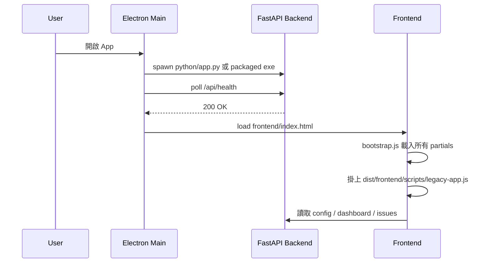

# Runtime Overview

Gitlab Tracker 目前是三層結構：

1. Electron main process
2. frontend partial-based UI
3. Python FastAPI backend

## 1. Process 結構

| 層級          | 主要檔案                                                                                                        | 職責                                               |
| ------------- | --------------------------------------------------------------------------------------------------------------- | -------------------------------------------------- |
| Electron Main | `src/main.ts`                                                                                                   | 啟動後端、建立視窗、處理 IPC、開外部連結、PDF 匯出 |
| Preload       | `src/preload.ts`                                                                                                | 暴露受控 bridge 給前端                             |
| Frontend      | `frontend/index.html`、`frontend/partials/*`、`frontend/scripts/bootstrap.js`、`frontend/scripts/legacy-app.ts` | 組裝 UI、呼叫 API、管理本地偏好                    |
| Backend       | `backend/app.py` + `backend/core/*`                                                                             | GitLab 同步、分析、AI、Issue Arrange、報表、排程   |

## 2. 啟動流程

關鍵細節：

- 後端固定 listen `127.0.0.1:8765`
- main process 會在 15 秒內輪詢 `/api/health`
- 開發模式優先使用 `.venv\Scripts\python.exe`
- 打包模式使用 `backend/dist/gitlab-tracker-backend/...`

## 3. 前端結構

`frontend/scripts/bootstrap.js` 會依序把下列 partial 掛到 DOM：

- `partials/sidebar.html`
- `partials/dashboard.html`
- `partials/arrange.html`
- `partials/connections.html`
- `partials/preferences.html`
- `partials/overlays.html`

之後再載入編譯好的 `dist/frontend/scripts/legacy-app.js`。

這表示畫面結構和互動邏輯已經拆開：

- HTML partial 負責骨架
- `legacy-app.ts` 負責事件、狀態與 API 呼叫
- CSS 依 `styles/pages/*` 與 `styles/shared/*` 組織

## 4. Electron Main 的責任

`src/main.ts` 目前主要負責：

- 啟動 / 關閉 backend child process
- 決定 dev 與 packaged 模式下的資料路徑
- 提供檔案選擇器 `dialog:openFile`
- 提供開檔 / 開外部連結 `shell:openPath`
- 用隱藏視窗 `printToPDF` 匯出報表
- 記住外部連結瀏覽器偏好

`src/preload.ts` 暴露的 bridge 很精簡：

- `openFileDialog()`
- `openPath(filePath)`
- `exportPdf(html)`
- `getAppVersion()`

## 5. Backend 模組分工

| 模組                     | 職責                                                              |
| ------------------------ | ----------------------------------------------------------------- |
| `backend/app.py`         | FastAPI routes、Gemini 呼叫、報表 HTML 組裝                       |
| `core/config_store.py`   | `config.json` / `meta.json` 路徑與讀寫                            |
| `core/gitlab_client.py`  | GitLab REST API client 與 issue normalization                     |
| `core/report_service.py` | dashboard summary、simplify_issue、weekly markdown                |
| `core/issue_arrange.py`  | URL parse、filter resolve、raw text 組裝、Excel row、歷史檔案管理 |
| `core/scheduler.py`      | daily sync / weekly report 背景排程                               |
| `core/utils.py`          | JSON I/O、日期與共用工具                                          |

## 6. 資料與控制流

### 一般專案追蹤

1. UI 呼叫 `/api/fetch`
2. 後端更新 `issues_cache.json`
3. UI 再讀 `/api/dashboard`、`/api/issues`、`/api/analytics`
4. 使用者在 dashboard / timeline / table 互動

### Issue Arrange

1. UI 送 Issue URL 或 filter URL
2. 後端解析 URL，向 GitLab 撈 issue 與 discussions
3. 後端產出 raw issue text
4. 後端呼叫 Gemini / Gemma 模型整理
5. 結果寫入 `arrange_exports/`
6. UI 顯示 raw / result，並可瀏覽歷史檔

### 報表

1. `/api/report/weekly` 產生 Markdown
2. `/api/report/html` 產生帶樣式 HTML
3. 前端把 HTML 交給 Electron main process
4. main process 以 Chromium `printToPDF` 匯出 PDF

## 7. 排程模型

排程由 `TrackerScheduler` 在 FastAPI 生命週期內啟動：

- 每 30 秒 tick 一次
- 依 `daily_sync_time` / `weekly_report_time` 檢查是否該執行
- 以 `meta.json.scheduler` 避免同一天重複跑

這是「App 內排程」，不是背景服務。只要 App 關閉，排程就不會執行。

## 8. 外部整合

| 整合                           | 位置                    | 用途                                      |
| ------------------------------ | ----------------------- | ----------------------------------------- |
| GitLab REST API v4             | `core/gitlab_client.py` | Issue、discussion、MR、links、filter 查詢 |
| Google Generative Language API | `backend/app.py`        | discussion summary、chat、issue arrange   |
| Electron Shell / Dialog        | `src/main.ts`           | 開檔、開網址、選 JSON、輸出 PDF           |
