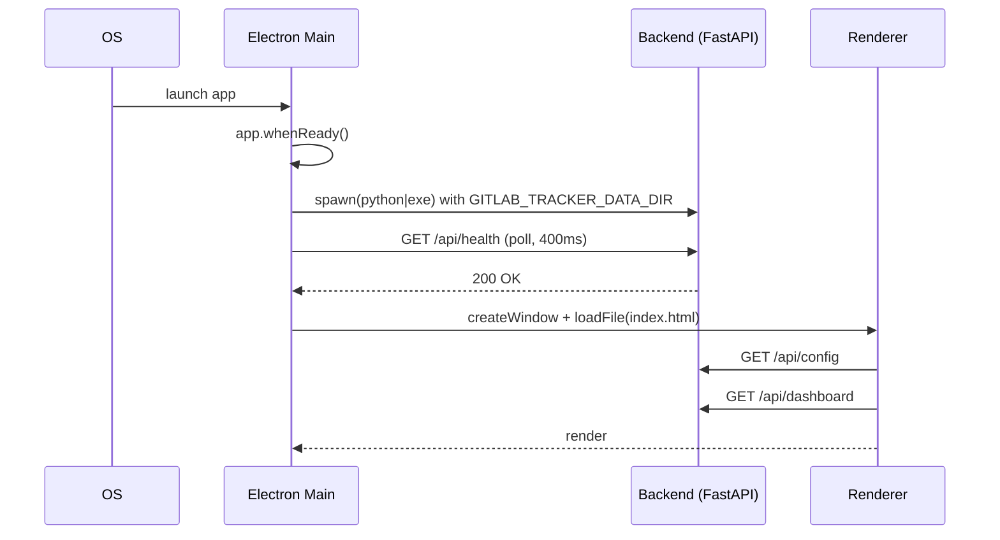

# Runtime Overview

說明 Gitlab Tracker 從「使用者點擊圖示」到「畫面呈現 Dashboard」的完整啟動鏈，以及執行期間各個 process / thread 的角色。

## 1. Process 結構

| Process | 啟動者 | 角色 |
| --- | --- | --- |
| **Electron Main** (`dist/src/main.js`) | OS 啟動 `Gitlab Tracker.exe` | 視窗管理、IPC、外部瀏覽器、PDF 匯出、生命週期 |
| **Renderer** (Chromium) | Main 透過 `BrowserWindow.loadFile()` | UI、所有業務邏輯（fetch API） |
| **Backend** (Python / PyInstaller exe) | Main 透過 `child_process.spawn()` | FastAPI server + Scheduler thread |

> Backend 永遠 **只 listen 127.0.0.1:8765**，不暴露在網路上。

## 2. 啟動序列



關鍵點：

- Main 會 `poll /api/health` 直到 200 才 `createWindow()`（[main.ts](../../src/main.ts) `waitForBackendReady`）。
- Backend 啟動於 venv (dev) 或 PyInstaller binary (packaged)，**Main 永遠透過 `--port 8765` 顯式指定**。
- `GITLAB_TRACKER_DATA_DIR` 由 Main 注入：dev 指向 `backend/data/`，packaged 指向 `app.getPath('userData')/tracker-data/`。

## 3. 執行緒模型（Backend）

| Thread | 來源 | 角色 |
| --- | --- | --- |
| Main / Uvicorn loop | `uvicorn.run(...)` | 處理 HTTP requests |
| Scheduler thread | `TrackerScheduler.start()` | 每 30 秒輪詢，命中 `daily_sync_time` / `weekly_report_time` 就執行任務 |

排程邏輯在 [scheduler.py](../../backend/core/scheduler.py)：

- 比對 `now.hour/minute` 與設定時間，並用 `meta.json#scheduler.<task>` 紀錄當天是否已跑過，避免重複。
- **應用程式關閉後就停止**，需要 24/7 排程請改用 OS-level cron / Task Scheduler 呼叫 `python backend/app.py --once fetch` 或 `--once weekly-report`。

## 4. 模組依賴

```text
backend/app.py
  ├── core.config_store   ─ JSON 讀寫、預設值、project_ref 歷史
  ├── core.gitlab_client  ─ GitLab REST client（issues / discussions / MR / links）
  ├── core.report_service ─ build_dashboard / generate_weekly_markdown
  ├── core.scheduler      ─ TrackerScheduler 背景執行緒
  └── core.utils          ─ JSON I/O、parse_dt、utc_now
```

- 所有 **side effect（檔案寫入、HTTP 呼叫）** 都集中在 `core/*`；`app.py` 只做組合。
- Renderer 不直接讀檔，所有資料都透過 backend 取得（PDF 匯出例外，由 main process `printToPDF` 完成）。

## 5. 前端執行流程

[renderer/app.ts](../../renderer/app.ts) 在 DOMContentLoaded 後：

1. `loadConfig()` → `GET /api/config` → 填表單，`localStorage` 同步快取一份避免閃白。
2. `refreshDashboard()` → `GET /api/dashboard` + `GET /api/issues` + `GET /api/analytics`。
3. 註冊事件：Tab 切換、Save Config、Sync Now、Generate Report、AI Chat、Issue Drawer 等。

所有 API 呼叫都透過 [`apiCall()`](../../renderer/app.ts) 包一層 fetch 並走 `http://127.0.0.1:8765`。

## 6. 對外通訊

| 方向 | 對象 | 入口 |
| --- | --- | --- |
| GET / POST | GitLab REST v4 | [`gitlab_client.py`](../../backend/core/gitlab_client.py)，header `PRIVATE-TOKEN` |
| POST | Google Generative Language (Gemini) | [`app.py`](../../backend/app.py) `summarize_discussions` / `chat_with_issues` |
| `shell.openExternal` | 使用者預設 / Chrome / Edge | [`main.ts`](../../src/main.ts) `openExternalUrlWithConfirmation` |

> 所有外部呼叫都集中在後端 + main process，**Renderer 不會直接連外**（這是安全與 CSP 的重要邊界）。
