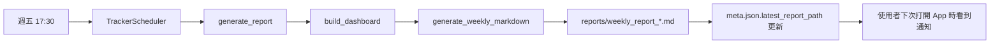
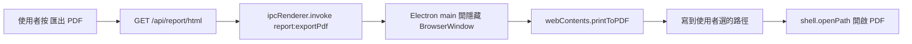

# Project Flow

從「使用者第一次安裝 App」到「每週五自動產出週報」的端到端流程。

## 1. 安裝與初始化

```mermaid
flowchart LR
  A[下載 Gitlab Tracker Setup.exe] --> B[NSIS 安裝]
  B --> C[首次啟動]
  C --> D[Main process spawn backend]
  D --> E[backend 寫入空白 config.json]
  E --> F[Renderer 顯示 GitLab 設定區]
  F --> G[使用者輸入 URL / Token / Project Ref]
  G --> H[POST /api/config]
  H --> I[使用者按「立即同步」]
  I --> J[POST /api/fetch → GitLab API]
  J --> K[寫入 issues_cache.json + meta.json]
  K --> L[Dashboard 顯示資料]
```



## 2. 日常使用

```mermaid
flowchart TD
  S[每天 09:00] -->|TrackerScheduler 命中| Sync[fetch_issues]
  Sync --> Cache[更新 issues_cache.json]
  Cache --> Diff[比對 user_notes_count 標記 has_new_discussions]
  
  U[使用者打開 App] --> Dash[GET /api/dashboard]
  U --> Iss[GET /api/issues]
  U --> Ana[GET /api/analytics]
  
  U -.點擊 Issue.-> Drawer[GET /api/issues/{iid}/discussions + MR + links]
  U -.點 AI 摘要.-> Sum[POST /api/issues/{iid}/discussions/summary]
  U -.輸入問題.-> Chat[POST /api/chat]
```

## 3. 每週五自動週報



## 4. 週報匯出 PDF



## 5. CLI 模式（給 OS-level 排程使用）

```bash
python backend/app.py --once fetch          # 只跑一次同步
python backend/app.py --once weekly-report  # 只產生一份週報
```

可結合 Windows Task Scheduler / cron，達到 App 不開也能定時跑。
